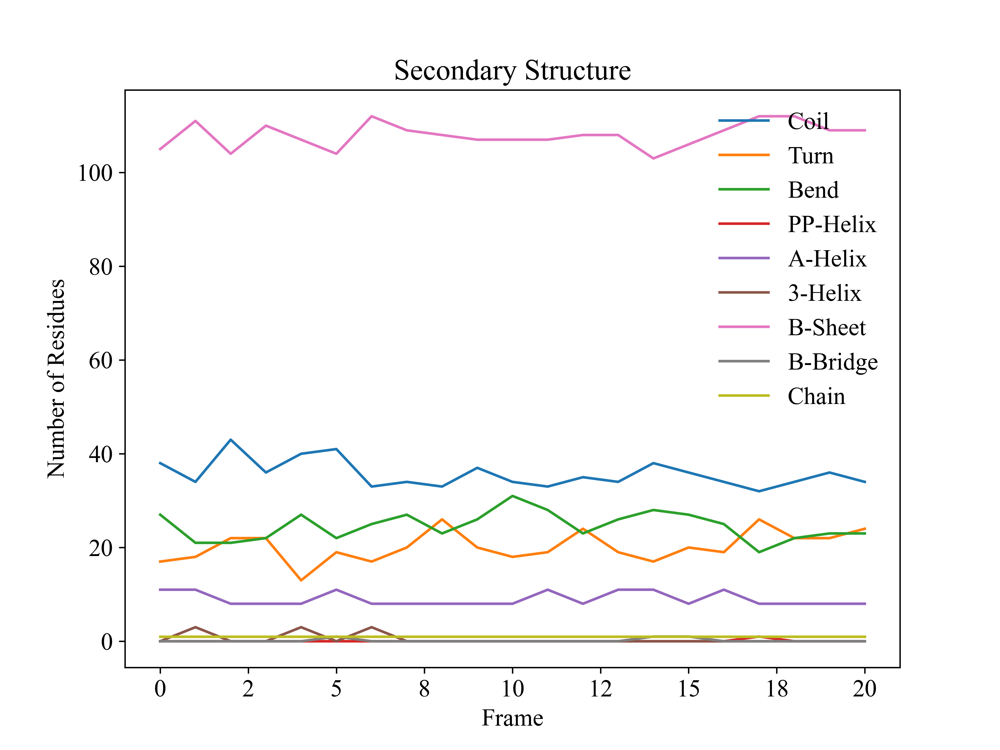
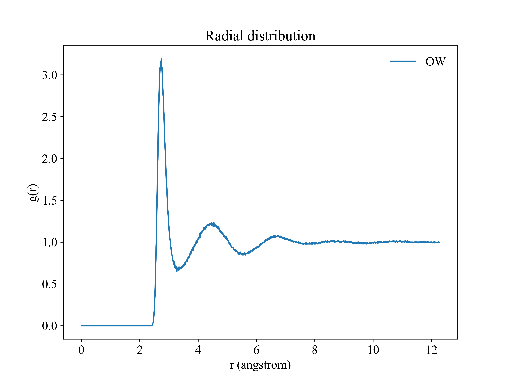
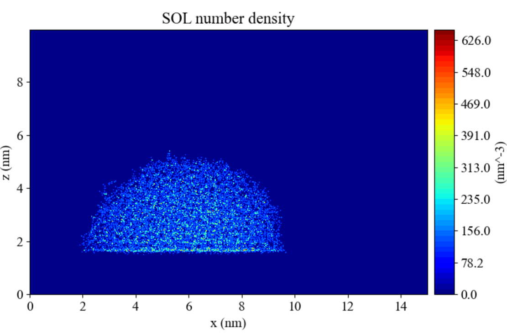

# Description

`gplt` is a very convenient python tool for plotting gromacs output file, such as `.xvg`, `.xpm` or convert `.dat` to `.xpm` for visualization. This tool is similar to [DuIvyTools](https://github.com/CharlesHahn/DuIvyTools), and these features could potentially be part of DuIvyTools. However, if time permits, I hope that it can become more powerful than DuIvyTools in the future.

# Install and Usage

Please refer to : https://gplt.readthedocs.io/en/latest/gplt.html#install

# Gallery

# Cite
If `gplt` is utilized in your work, please cite as follows in main text:

> Yujie Liu, gplt (v0.1.12). Zenodo. https://doi.org/10.5281/zenodo.13208831

