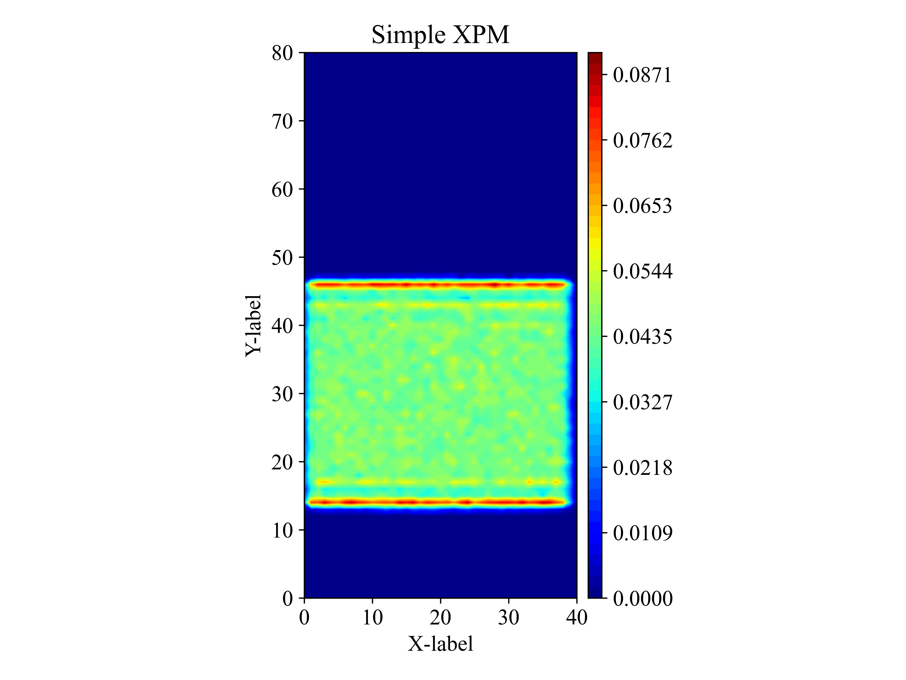

# Description

`gplt` is a very convenient python tool for plotting gromacs output file, such as `.xvg`, `.xpm` or convert `.dat` to `.xpm` for visualization. This tool is similar to [DuIvyTools](https://github.com/CharlesHahn/DuIvyTools), and these features could potentially be part of DuIvyTools. However, if time permits, I hope that it can become more powerful than DuIvyTools in the future.


# Cite

```{attention}
If `gplt` is utilized in your work, please **MUST** cite as follows in main text:

> Yujie Liu, gplt. Zenodo. [https://doi.org/10.5281/zenodo.13208831](https://doi.org/10.5281/zenodo.13208831)
```


# Installation

* Requirements

  * `Python >= 3.8`
  * `numpy`, `matplotlib`, `openpyxl`, etc.
  
* Install

  The module is installed by `pip` method:

  ```
  pip install numpy matplotlib colorama pandas openpyxl
  pip install gplt -i https://test.pypi.org/simple
  ```

  Please **ALWAYS** install Latest version.

  Update this module if you have installed:
  ```
  pip install gplt --upgrade -i https://test.pypi.org/simple
  ```

# Usage
## General options

Use `-h` to show available options:

```bash
gplt -h
```


## Plot xvg

```bash
gplt -f rdf.xvg
gplt -f rdf.xvg -ux angstrom
```
<div style="display: flex; justify-content: space-between;">
  
  
</div>


Of course support multi-figures:

```
gplt -f rdf1.xvg rdf2.xvg -legend lab1 lab2
```


## Plot xpm

### Free Energy Landscape

```bash
gplt -f gibbs.xpm
gplt -f gibbs.xpm -d3
```
<div style="display: flex; justify-content: space-between;">
  
  
</div>


### Protein Structure

```
gplt -f ss.xpm
```


### Hydrogen Bonds

If you provide three files:  `hbond.ndx` and `hbmap.xpm` generated by `gmx hbond` and system `.gro` ,  the program can use `Donor-Acceptor` label (`resname+resid@atomname`) to replace yticks.

```{note}
The ndx file name must be placed before the gro/xpm file
```

```
gplt -f hbond.ndx 1EBZ.gro hbmap.xpm -yaxis 'Hbonds Pairs' -title ''
```


````{note}
You can change some plotting style by [Matplotlib style](https://matplotlib.org/stable/tutorials/introductory/customizing.html#the-matplotlibrc-file). Write a plain text file `style.mplstyle`:
```
axes.labelsize:     8
axes.linewidth:     1
xtick.labelsize:    8
ytick.labelsize:    8
ytick.left:         True
ytick.direction:    in
xtick.bottom:       True
xtick.direction:    in
lines.linewidth:    1.5
legend.fontsize:    8
legend.loc:         best
font.family:        Times New Roman
font.size:          8
```
Then add `-style style.mplstyle` option to gplt command line
````


## Plot dat

The `.dat` file was generated by gromacs tool, such as `densmap.dat`, `dssp.dat` (gmx dssp)

1. `.dat` from `gmx densmap -od`

```
gplt -f densmap.dat && gplt -f densmap.xpm -aspect equal
```

This command will generate a `densmap.xpm` file, then you can plot it.

`-aspect equal`: Use same scaling from data to plot units for x and y


2. `dssp.dat` from `gmx dssp` (gmx >= 2023)

   ```
   gplt -f dssp.dat && gplt -f dssp.xpm -xprec 0 -yprec 0 -o dssp.png && gplt -f scount.xvg -xprec 0 -yprec 0 -o scount.png
   ```


3. `.dat` with xyz columns

    `gplt` also supports the file with three columns `xbin ybin zvalue`, such as:
    ```
    1 14 0.0771830985915493
    4 14 0.0771830985915493
    7 14 0.0876056338028169
    4 16 0.03492957746478873
    6 13 0.011830985915492958
    9 14 0.07887323943661971
    16 14 0.08647887323943662
    12 17 0.05718309859154929
    13 14 0.07549295774647888
    ```
    x and y of grid point must be integer.

    ```
    gplt -f xyz.dat && gplt -f xyz.xpm -aspect equal
    ```

    
